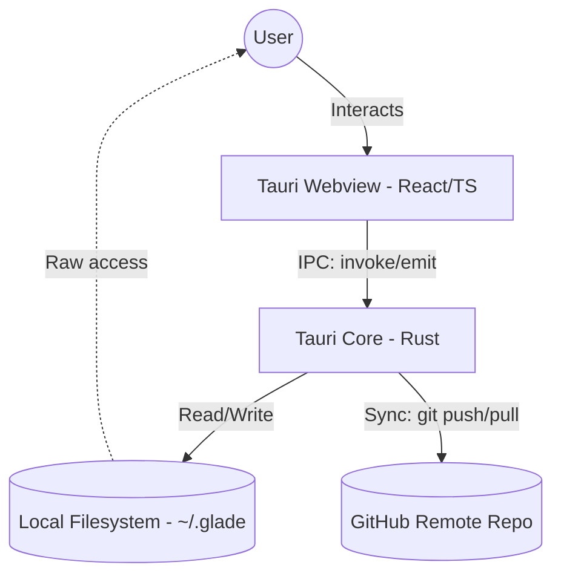

# Architecture Overview

Glade is a cross-platform desktop application built using the **Tauri v2** framework. It follows a "local-first" philosophy, where the primary data store is the user's local filesystem, supplemented by Git for versioning and synchronization.

## High-Level Diagram

## The Bridge (Frontend vs. Backend)

### Frontend (React/TypeScript)
The frontend is responsible for the UI, state management (via **Zustand**), and handling complex user interactions in the editor.
- **Editor**: Powered by **TipTap 2**, providing a rich text experience that maps directly to Markdown.
- **State**: Zustand manages the UI state, theme, and cached note data for fast navigation.
- **IPC**: Commands are sent to the Rust backend using Tauri's `invoke` API.

### Backend (Rust)
The Rust backend handles all "heavy" and system-level tasks.
- **File Management**: Direct access to the `~/.glade` directory for reading and writing `.md` files and attachments.
- **Search Engine**: A custom search implementation that indexes and searches note content across the entire vault.
- **Git Integration**: Executes Git commands to manage version history and synchronize with the remote repository.
- **System APIs**: Handles window management, system tray, and secure storage for GitHub tokens.

## Data Flow: Saving a Note

1. User stops typing in the React editor.
2. An auto-save debouncer triggers after 1.5 seconds.
3. The frontend sends the updated Markdown content and metadata to the backend via a `save_note` command.
4. The Rust backend writes the file to the local filesystem.
5. Periodically (or on manual trigger), a background sync process commits these changes to the local Git repo and pushes to GitHub.
